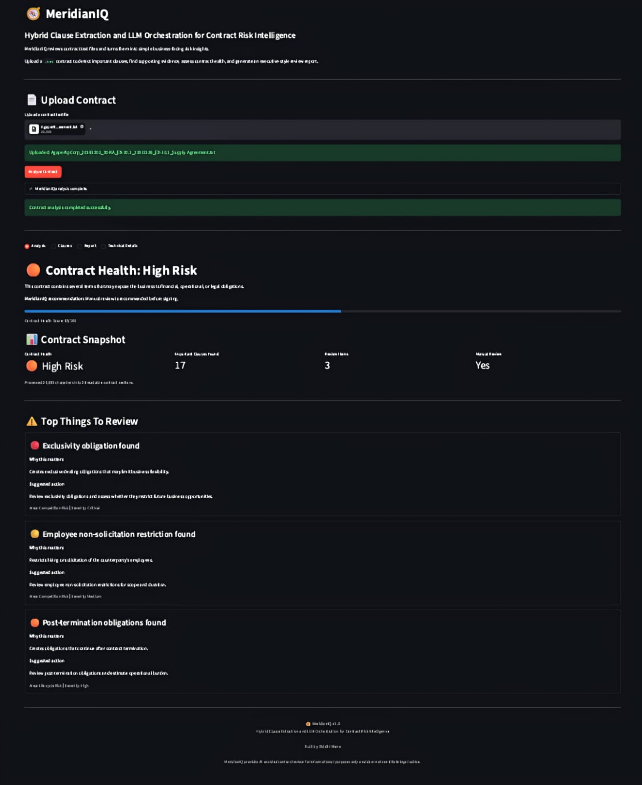
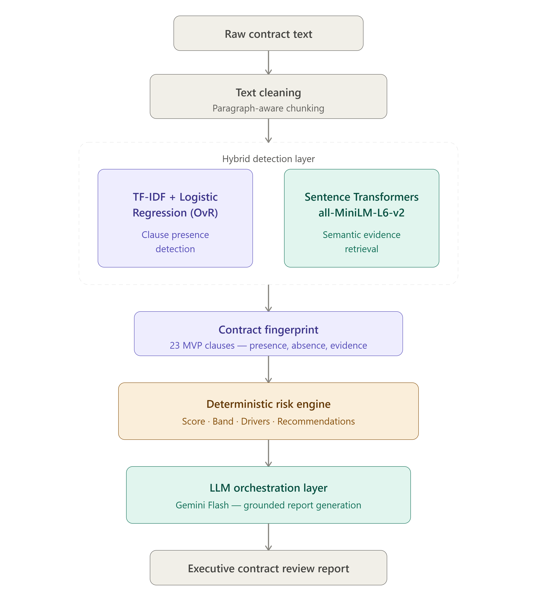
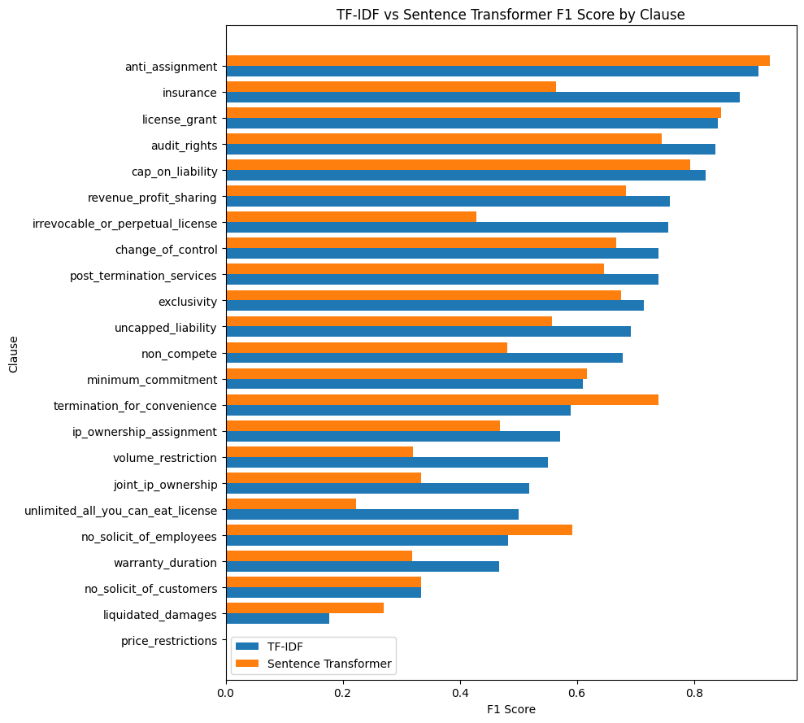

# 🧭 MeridianIQ
### Hybrid Clause Extraction and LLM Orchestration for Contract Risk Intelligence

&nbsp;

> *Most NLP systems stop at "What does this contract say?"*
>
> *MeridianIQ answers "What does this contract mean for the business — and what should you do about it?"*

&nbsp;

---

## The Problem

A founder receives a 65-page commercial agreement. The meeting starts in an hour.

Buried somewhere inside that document is an uncapped liability clause, an automatic renewal provision, and an IP ownership clause that quietly transfers future work to the other party.

Nothing looks suspicious. Nothing is highlighted.

> **Missing it could cost millions.**

Reading every page carefully takes hours. Hiring outside legal counsel for every agreement isn't always realistic.

**This is the gap MeridianIQ was built to reduce.**

&nbsp;

---

## What It Does

Upload a `.txt` commercial contract. In seconds, MeridianIQ:

- 🔍 &nbsp; Detects which of **23 high-value legal clauses** are present or absent
- 📌 &nbsp; Retrieves the **exact contract passages** supporting each detection
- 📊 &nbsp; Scores overall contract risk on a **calibrated 0–100 scale**
- ⚠️ &nbsp; Identifies **specific clauses driving that risk** with severity levels and business context
- 📄 &nbsp; Generates a **structured executive review report** — deterministic by default, Gemini-powered when an API key is provided

The output is not a list of clause labels. It is actionable contract intelligence — the kind a junior legal analyst would produce after a careful first read.

&nbsp;

> ### 🚀 [Try the Live Demo → meridianiq.streamlit.app](https://meridianiq.streamlit.app/)

&nbsp;



---

## Why This Is Different

There are two things most contract AI projects do.

The first is fine-tune a transformer on legal QA and report extraction accuracy. The second is wrap an LLM call around a PDF and call it done.

**MeridianIQ does neither.**

Instead of asking one model to solve everything, MeridianIQ breaks contract intelligence into smaller reasoning problems and gives each one the tool that performs best.

That is a deliberate architectural argument: different components of contract intelligence require different tools, and combining them correctly is what separates a research experiment from a system that actually works.

&nbsp;

MeridianIQ deliberately separates extraction, retrieval, risk assessment, and communication. Each stage has one responsibility. Each output becomes evidence for the next.



&nbsp;

**Why TF-IDF for detection and not a transformer?**

Because the data said so. Notebook 04 runs a direct empirical comparison across all 23 MVP clauses. TF-IDF wins — CUAD clause contexts contain highly consistent legal phrasing where exact term overlap is genuine signal. Using the more sophisticated model for the wrong task would have been the worse engineering decision.



**Why a deterministic risk engine and not a language model?**

Because contract risk scoring needs to be auditable. Every point in the final score traces back to a specific clause, a specific weight, and a specific logic rule. A recruiter, a user, or a lawyer can inspect every decision the system made. In a legal context, explainability is not optional.

**Why is the LLM last?**

Because it is the communication layer, not the reasoning layer. Gemini receives only verified ML outputs. The prompt explicitly prohibits inventing clauses, dates, parties, or obligations. If evidence is weak, the model is instructed to say so. This is hallucination prevention by design — not by luck.

The LLM never decides what is true. It only explains what MeridianIQ has already verified. That is the difference between AI-assisted communication and AI-generated reasoning.

&nbsp;

---

## The Dataset

Built on **CUAD** — the Contract Understanding Atticus Dataset, published at NeurIPS 2021.

| | |
|---|---|
| **Contracts** | 510 real commercial agreements from SEC EDGAR filings |
| **Clause categories** | 41 expert-labelled legal clause types |
| **Annotations** | 13,000+ labels by legal professionals |
| **Contract types** | Licensing · Service · Manufacturing · Joint Venture · Distribution · Sponsorship · Strategic Alliance |
| **License** | CC BY 4.0 |
| **Paper** | Hendrycks et al., 2021 — [arxiv.org/abs/2103.06268](https://arxiv.org/abs/2103.06268) |

These are not synthetic contracts. These are real agreements that real companies signed and filed with the SEC. The business complexity is genuine.

&nbsp;

---

## The 23 MVP Clauses

Selected for maximum business impact, not maximum coverage. Every clause maps to a real business consequence.

| Risk Domain | Clauses |
|---|---|
| 🔴 &nbsp; Liability Risk | Uncapped Liability · Cap On Liability · Insurance · Liquidated Damages |
| 🟠 &nbsp; Competition Risk | Non-Compete · Exclusivity · No-Solicit Of Customers · No-Solicit Of Employees |
| 🟡 &nbsp; IP Risk | IP Ownership Assignment · Joint IP Ownership · License Grant · Irrevocable Or Perpetual License · Unlimited License |
| 🟡 &nbsp; Financial Risk | Minimum Commitment · Revenue/Profit Sharing · Price Restrictions · Volume Restriction |
| 🟢 &nbsp; Control Risk | Anti-Assignment · Change Of Control |
| 🟢 &nbsp; Lifecycle Risk | Termination For Convenience · Post-Termination Services · Audit Rights · Warranty Duration |

Each clause carries a **role** (Risk if Present / Risk if Missing / Contextual), a **severity**, a calibrated **risk weight**, a plain-English **business description**, and a **recommended review action**.

&nbsp;

---

## Risk Scoring

The risk engine is fully deterministic and fully explainable.

```python
for clause in mvp_clauses:
    if clause_role == "Risk if Present" and clause_present:
        risk_score += weight

    elif clause_role == "Risk if Missing" and not clause_present:
        risk_score += weight
```

| Band | Score |
|---|---|
| 🟢 &nbsp; Low Risk | 0 – 25 |
| 🟡 &nbsp; Moderate Risk | 26 – 50 |
| 🟠 &nbsp; High Risk | 51 – 75 |
| 🔴 &nbsp; Critical Risk | 76 – 100 |

Every point in the final score is traceable. No black box. No number you cannot explain.

&nbsp;

---

## Notebook Pipeline

MeridianIQ wasn't built in one notebook. It was engineered in nine stages. Each notebook produces a reusable artifact that becomes the input to the next stage.

| # | Notebook | What It Builds |
|---|---|---|
| 01 | Data Understanding | CUAD structure, clause distributions, binary vs entity fields, presence rates, clause correlations |
| 02 | Clause Selection & Risk Taxonomy | MVP clause selection, risk domain mapping, severity assignment, weight calibration, business descriptions → `clause_risk_config.csv` |
| 03 | Preprocessing & Contract Fingerprint | Binary + entity fingerprints, lifecycle feature engineering, clause context table, clause answer table |
| 04 | Clause Detection Models | TF-IDF vs Sentence Transformer comparison, OvR Logistic Regression, per-clause F1, F1 delta analysis, model selection decision |
| 05 | Semantic Retrieval & Evidence Engine | Evidence corpus, enriched clause queries, cosine similarity matrix, top-K retrieval, top-1 and top-5 accuracy |
| 06 | Risk Engine & Decision Intelligence | `score_contract()`, `assign_risk_band()`, recommendation engine, domain-level summaries, risk distribution across 510 contracts |
| 07 | Raw TXT Contract Processing | Text cleaning, paragraph-aware chunking, full pipeline on raw text — bridging CUAD to real user input |
| 08 | LLM Orchestration & Report Generation | Structured report payload, rule-based fallback, constrained Gemini prompt, grounded executive report |
| 09 | End-to-End Demo | Full pipeline on a user-uploaded contract via reusable `src/` modules — raw text to executive report in one run |

&nbsp;

---

## Project Structure

```
MeridianIQ/
|
|-- notebooks/                    # 9 notebooks, run in order
|
|-- src/
|   |-- text_processing.py        # Cleaning + paragraph-aware chunking
|   |-- clause_detection.py       # TF-IDF clause prediction pipeline
|   |-- evidence_retrieval.py     # Sentence Transformer evidence retrieval
|   |-- risk_engine.py            # Risk scoring, band assignment, driver extraction
|   |-- report_generator.py       # Rule-based report + payload builder
|   |-- llm_orchestrator.py       # Gemini prompt engineering + report generation
|   |-- fingerprint_builder.py    # Utilities and fingerprint helpers
|   `-- column_groups.py          # Column grouping utilities for CUAD fields
|
|-- models/
|   |-- tfidf_vectorizer.pkl
|   |-- baseline_clause_detector.pkl
|   `-- semantic_clause_detector.pkl
|
|-- data/
|   |-- CUAD/                     # Raw CUAD dataset (not tracked in git)
|   |-- processed/                # Fingerprints, clause tables, config files
|   `-- reports/                  # Extraction metrics, retrieval summaries
|
|-- assets/                       # App assets
|-- app/
|   `-- streamlit_app.py
|
|-- requirements.txt
|-- runtime.txt
`-- .gitignore
```

&nbsp;

---

## The Streamlit App

Four tabs. Two audiences. One pipeline.

**📊 Analysis**

Contract Health score with visual risk band. Contract Snapshot showing clauses found, review items, and manual review recommendation. Top Things To Review — highest-priority risk drivers with severity colour coding, business impact, and suggested actions.

**📖 Clauses**

What MeridianIQ Found — the full detected clause list. Where MeridianIQ Found It — expandable evidence panels showing the exact contract text behind each detection. No similarity scores or technical metadata in this view. Just the evidence.

**📄 Report**

The complete executive review report. Rule-based by default — always available, always explainable. Toggle Gemini in the sidebar and enter a free API key from [Google AI Studio](https://aistudio.google.com) for a Gemini Flash executive summary. Download the report, payload, and Gemini prompt directly from the app.

→ [View a sample Gemini-generated report](assets/meridianiq_gemini_report.md)

**🔧 Technical Details**

Model outputs, retrieval metadata, similarity scores, ranks, processed chunks, and payload data. For anyone who wants to see exactly what happened under the hood.

> V1 supports `.txt` contract uploads. PDF support is on the V2 roadmap.

&nbsp;

---

## Getting Started

```bash
# Clone
git clone https://github.com/siddhimane8/MeridianIQ.git
cd MeridianIQ

# Install
pip install -r requirements.txt

# Download CUAD
# https://www.atticusprojectai.org/cuad
# Place master_clauses.csv and full_contract_txt/ inside data/CUAD/

# Run notebooks in order: 01 --> 09

# Launch
streamlit run app/streamlit_app.py
```

Gemini API key is optional. MeridianIQ runs fully without it using the rule-based engine. To enable Gemini executive summaries, get a free key at [aistudio.google.com](https://aistudio.google.com) and enter it in the app sidebar.

&nbsp;

---

## Architectural Decisions Worth Asking About

Four decisions that turned this from a project into a system.

**TF-IDF beats Sentence Transformers on clause detection** — not assumed, measured. Notebook 04 runs the comparison across all 23 MVP clauses. TF-IDF wins because CUAD clause contexts contain highly consistent legal phrasing. The more sophisticated model was evaluated and rejected for this specific task.

**Risk scoring is deterministic, not predicted** — every score is fully auditable. Every point traces to a clause, a weight, and a logic rule. Explainability matters when the domain is legal.

**Missing values are signals, not noise** — in legal contracts, absence is often meaningful. A missing Cap On Liability clause is a risk event. MeridianIQ treats absence as a first-class input to the risk engine, not a data quality problem to be imputed away.

**LLM orchestration, not LLM reasoning** — the pipeline produces all the intelligence before Gemini is called. The LLM rewrites structured outputs into executive language. It cannot invent facts. Responsible AI design applied to a domain where the stakes are real.

&nbsp;

---

## What's Next

MeridianIQ V1 establishes the core pipeline. These are the directions V2 will explore.

- **PDF support** — direct upload of `.pdf` contracts without manual conversion
- **Multi-contract analysis** — batch processing and cross-contract risk comparison
- **Clause-level confidence calibration** — improving retrieval precision for low-signal clauses
- **Broader clause coverage** — expanding beyond the 23 MVP clauses toward the full CUAD taxonomy
- **Jurisdiction awareness** — flagging governing law and dispute resolution clauses in the context of the user's region

&nbsp;

---

## Limitations

- V1 processes `.txt` contracts only. PDF conversion required before upload.
- Detection model trained on CUAD — primarily US commercial contracts in English. Performance on non-English or non-US agreements has not been evaluated.
- MeridianIQ is for preliminary business review. It is not a substitute for qualified legal counsel.

---

## Acknowledgements

- **CUAD** — The Atticus Project. Hendrycks et al., NeurIPS 2021. [arxiv.org/abs/2103.06268](https://arxiv.org/abs/2103.06268)
- **Sentence Transformers** — Reimers & Gurevych, 2019. `all-MiniLM-L6-v2`
- **Gemini Flash** — Google DeepMind

&nbsp;

---

## Author

**Noah** — Third-year B.E. student in Artificial Intelligence & Machine Learning

Building a focused AI/ML portfolio targeting international opportunities in the European market.

- 🐙 &nbsp; GitHub — [github.com/siddhimane8](https://github.com/siddhimane8)
- 💼 &nbsp; LinkedIn — [linkedin.com/in/siddhimane8](https://linkedin.com/in/siddhimane8)

&nbsp;

---

## Author

**Siddhi Mane** — Artificial Intelligence and Machine Learning Student

[](https://github.com/siddhimane8)

&nbsp;

---

## Author

**Siddhi Mane** — Artificial Intelligence and Machine Learning Student

GitHub: [github.com/siddhimane8](https://github.com/siddhimane8)

## Author

**Siddhi Mane** — Artificial Intelligence and Machine Learning Student

GitHub: [github.com/siddhimane8](https://github.com/siddhimane8)

&nbsp;

---

*Built as part of an AI/ML portfolio focused on real-world document intelligence and production-aware system design.*
